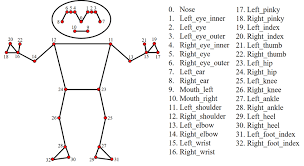
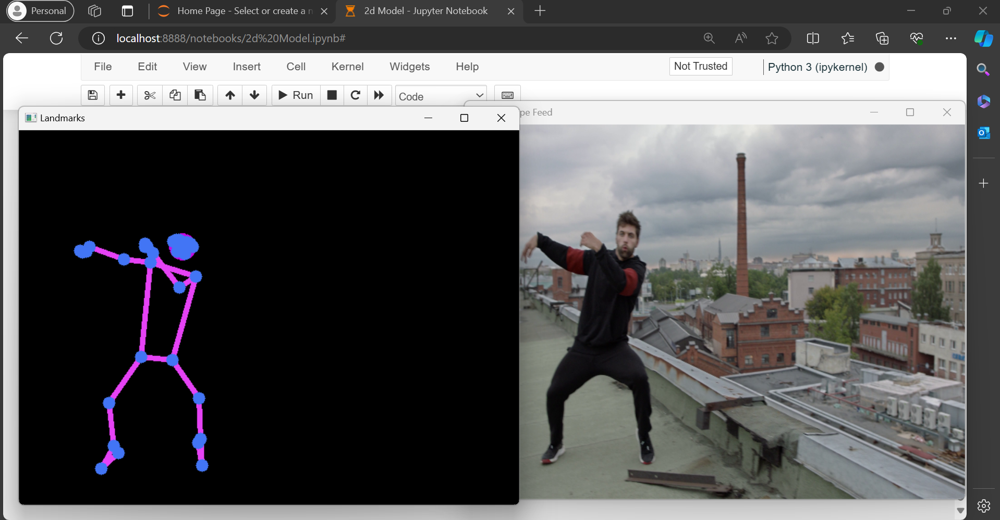

# Pose Detection and Landmark Visualization with MediaPipe

# Overview

This project utilizes the MediaPipe library to perform real-time 2D pose detection and landmark visualization in images or video streams. It provides robust detection of full-body poses in real time and converts them into a 2D model representation.

# Features

1) **Real-time Pose Detection:**: Utilizes the power of MediaPipe to achieve real-time detection of human poses from images or video streams.

2) **Full Body Detection:** Accurately detects and tracks key landmarks representing the full body, including head, torso, arms, and legs.

3) **2D Model Conversion:** Converts the detected poses into a 2D model representation, providing a visual representation of the human body's pose and structure.

4) **Highly Customizable:** The project is highly customizable, allowing users to adjust parameters and configurations to suit their specific requirements.

5) **Easy Integration:** Designed for ease of integration into existing projects or workflows, with simple installation and usage instructions provided.

# DEMO

   

